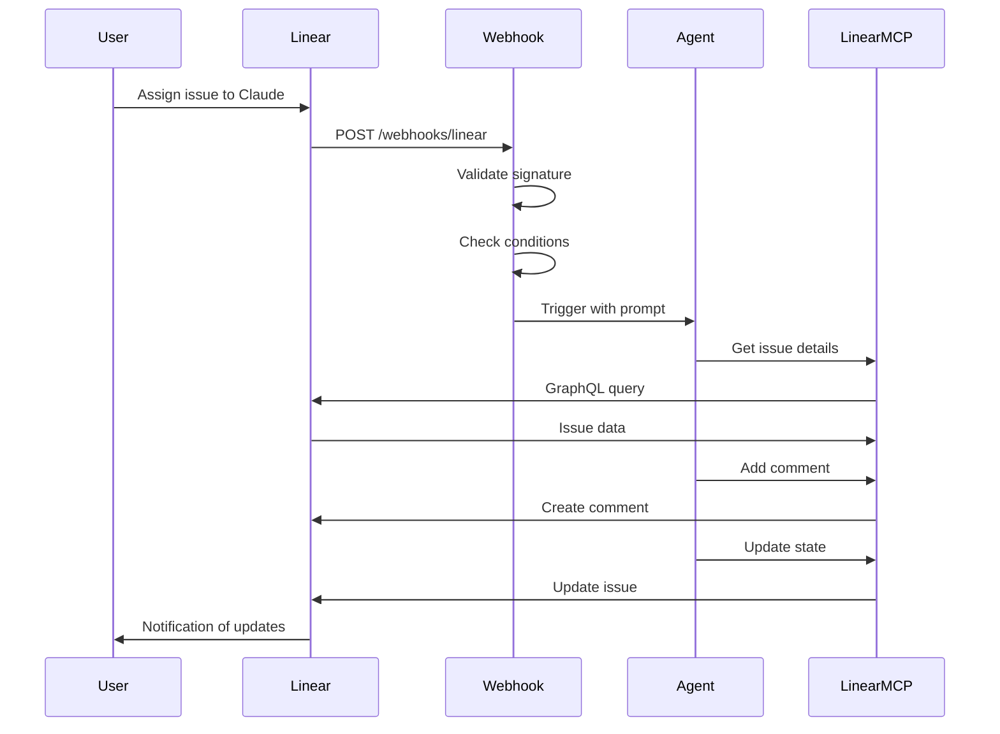

# Linear MCP + Webhook Integration Guide

This guide shows how to set up the webhook server to automatically trigger agents when issues are assigned to "Claude", with the agent using Linear MCP to interact with Linear.

## Architecture

```
Linear → Webhook → Agent Runner → Agent (with Linear MCP) → Linear
```

1. User assigns issue to "Claude" in Linear
2. Linear sends webhook to your server
3. Webhook server triggers agent with conditional routing
4. Agent uses Linear MCP tools to work on and update the issue

## Setup Steps

### 1. Configure Linear MCP Server

In your `.env` or `config.yaml`:

```yaml
mcp_servers:
  - name: linear
    type: stdio
    command: npx
    args:
      - -y
      - "@modelcontextprotocol/server-linear"
    env:
      LINEAR_API_KEY: lin_api_your_key_here
```

Or via environment variable:
```bash
CAF_MCP_SERVERS='[{"name":"linear","type":"stdio","command":"npx","args":["-y","@modelcontextprotocol/server-linear"],"env":{"LINEAR_API_KEY":"lin_api_your_key_here"}}]'
```

### 2. Configure Webhook Server

Add to `.env`:

```bash
# Webhook Configuration
CAF_WEBHOOK__ENABLED=true
CAF_WEBHOOK__HOST=0.0.0.0
CAF_WEBHOOK__PORT=8000
CAF_WEBHOOK__LINEAR_WEBHOOK_SECRET=whsec_your_webhook_secret_here
CAF_WEBHOOK__ROUTES_FILE=./examples/webhook_routes_claude_assignee.yaml

# Anthropic API Key
ANTHROPIC_API_KEY=sk-ant-your_key_here

# Agent Configuration
CAF_AGENT__MODEL=sonnet
CAF_AGENT__MAX_TURNS=30
CAF_AGENT__PERMISSION_MODE=acceptEdits
```

### 3. Set Up Linear Webhook

1. Go to Linear Settings → API → Webhooks
2. Click "New Webhook"
3. Set URL: `https://your-domain.com/webhooks/linear`
4. Copy the signing secret to `CAF_WEBHOOK__LINEAR_WEBHOOK_SECRET`
5. Select events to receive:
   - ✅ Issue updated
6. Save webhook

### 4. Create User Named "Claude" in Linear

1. Go to Linear Settings → Members
2. Invite a new member with email like `claude@your-domain.com`
3. Set the name to exactly "Claude"
4. Confirm invitation

Alternatively, just use your existing username in the route conditions.

### 5. Start the Webhook Server

```bash
caf webhook --routes examples/webhook_routes_claude_assignee.yaml
```

Or with custom port:
```bash
caf webhook --port 8080 --routes examples/webhook_routes_claude_assignee.yaml
```

## Testing

### Test 1: Assign Issue to Claude

1. Create a new issue in Linear
2. Assign it to "Claude"
3. Watch the webhook server logs
4. The agent should:
   - Acknowledge the assignment
   - Move issue to "In Progress"
   - Add a comment
   - Work on the issue based on the description

### Test 2: Check Webhook Server

```bash
# Health check
curl http://localhost:8000/health

# Should return: {"status":"healthy"}
```

### Test 3: Verify Conditions

The webhook route only triggers when:
- Event is `Issue.update` ✓
- `assignee.name` equals "Claude" ✓
- Assignee field changed ✓

Other issue updates won't trigger the agent.

## Example Workflow



## Customizing Routes

### Match Multiple Assignees

```yaml
- event_pattern: Issue.update
  conditions:
    - field: assignee.name
      operator: in
      value: [Claude, AutoBot, AI Assistant]
```

### Only High Priority

```yaml
- event_pattern: Issue.update
  conditions:
    - field: assignee.name
      operator: equals
      value: Claude
    - field: priority
      operator: in
      value: [1, 2]  # Urgent or High
```

### Specific Labels

```yaml
- event_pattern: Issue.update
  conditions:
    - field: assignee.name
      operator: equals
      value: Claude
    - field: labels
      operator: contains
      value: automation
```

### State Changes

```yaml
- event_pattern: Issue.update
  conditions:
    - field: state.name
      operator: equals
      value: Ready to Start
    - field: state
      operator: changed
```

## Available Linear MCP Tools

When the agent runs, it has access to these Linear MCP tools (if configured):

- `create_issue` - Create new issues
- `update_issue` - Update issue fields
- `add_comment` - Add comments to issues
- `search_issues` - Search for issues
- `get_issue` - Get issue details
- `list_teams` - List teams
- `list_projects` - List projects

Check your Linear MCP server documentation for the exact tool names.

## Troubleshooting

### Webhook Not Triggering

1. Check webhook server logs for incoming requests
2. Verify Linear webhook secret matches
3. Check route conditions are correct
4. Test with `--generate-routes` to see default rules

### Agent Not Using Linear MCP

1. Verify MCP server is configured in settings
2. Check MCP server starts without errors
3. Test MCP server independently: `caf run "List my Linear issues"`
4. Check agent has permission to use MCP tools

### Conditions Not Matching

Enable debug logging:
```bash
CAF_LOGGING__LOG_LEVEL=DEBUG caf webhook
```

This will show which conditions passed/failed.

## Cost Optimization

To avoid unnecessary agent runs:

1. **Use specific conditions** - Don't use `event_pattern: "*"`
2. **Check field changes** - Use `operator: changed` to only trigger when fields actually change
3. **Set budget limits** - Use `CAF_AGENT__MAX_BUDGET_USD=5.0`
4. **Monitor logs** - Track which routes trigger most often
5. **Disable unused routes** - Set `enabled: false` on routes you're testing

## Production Deployment

See `WEBHOOKS.md` for full deployment guide including:
- Docker deployment
- systemd service
- Nginx reverse proxy with HTTPS
- Security best practices

## Next Steps

1. Test the basic workflow with a simple issue
2. Customize the prompt template for your use case
3. Add more conditional routes for different scenarios
4. Set up monitoring and alerting
5. Configure Slack notifications for agent results

## Support

- Main webhook docs: `WEBHOOKS.md`
- Example routes: `examples/webhook_routes_linear.yaml`
- Linear MCP: https://github.com/modelcontextprotocol/servers
